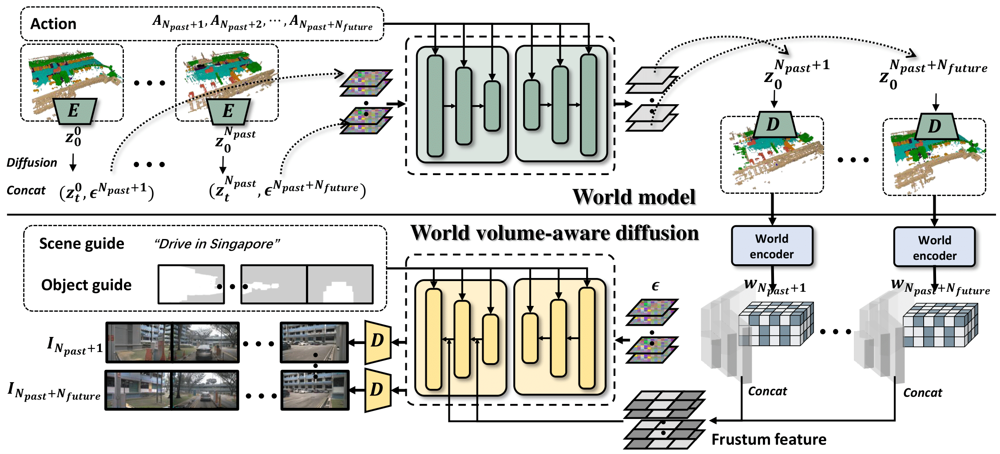
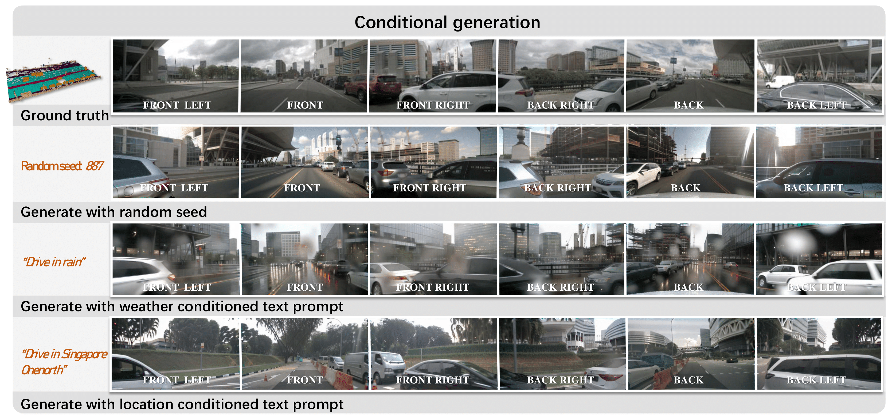
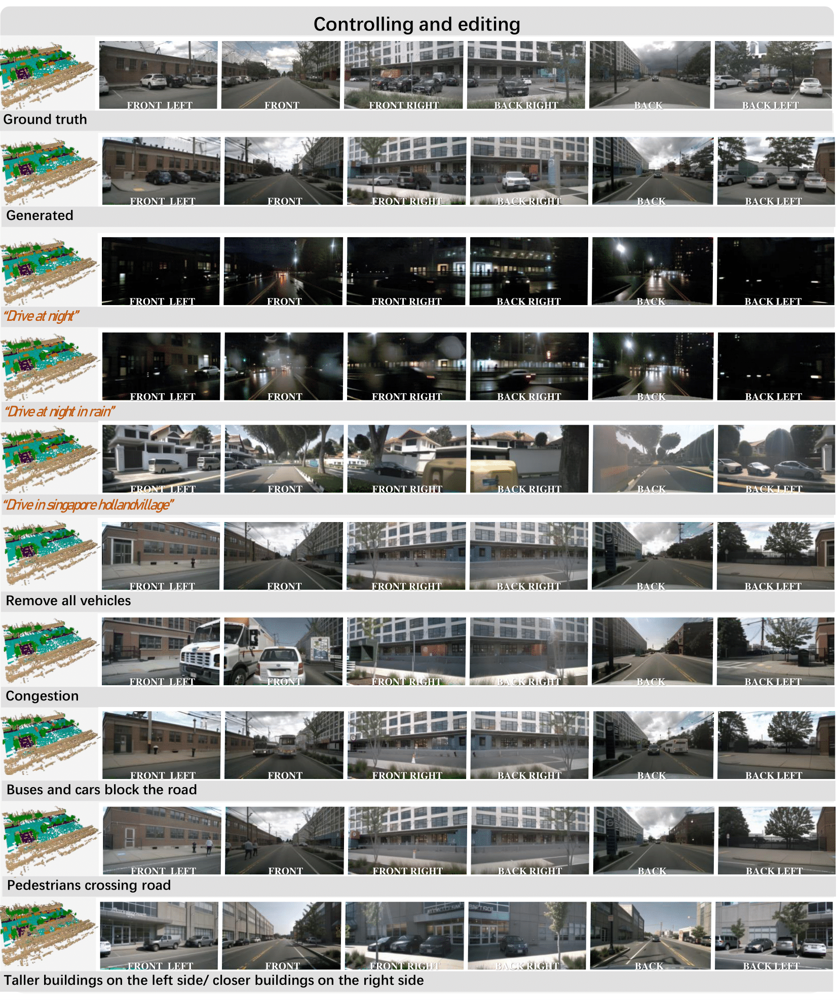
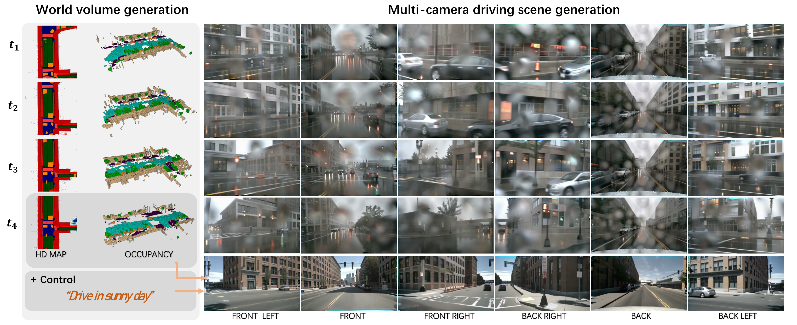
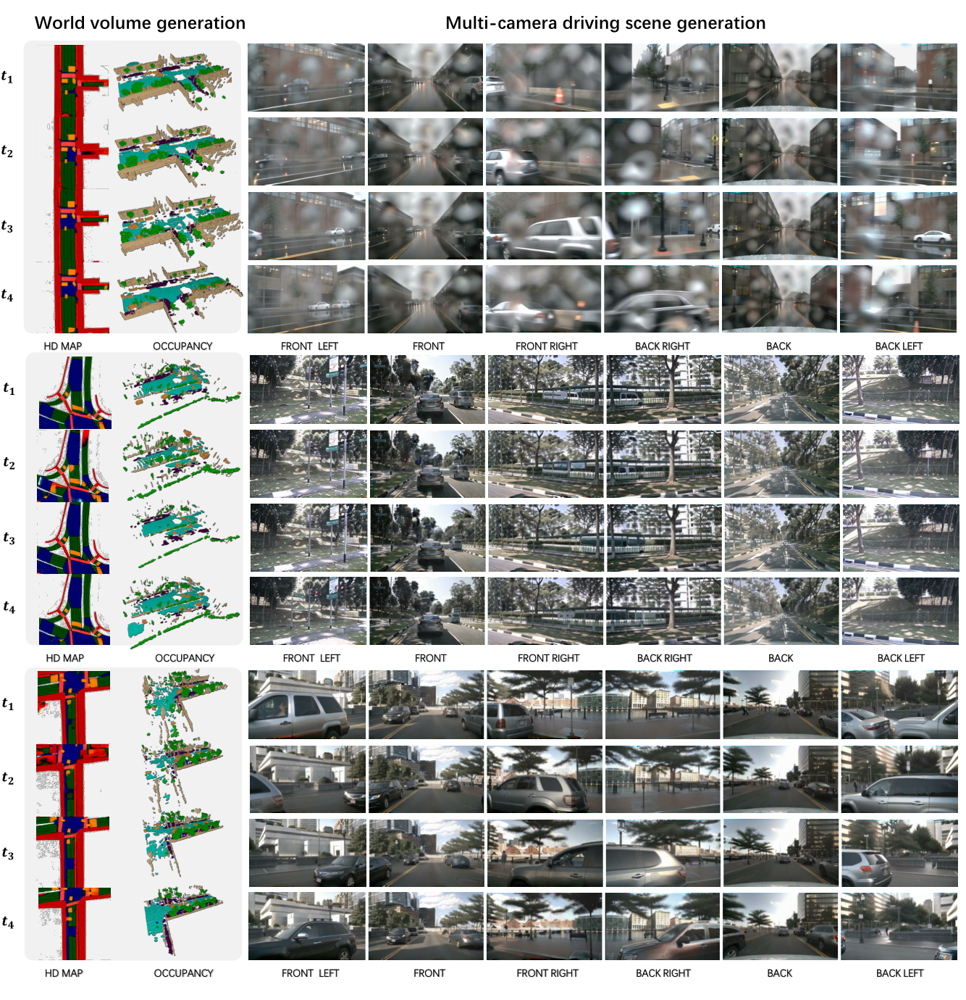

# WoVoGen: World Volume-aware Diffusion for Controllable Multi-camera Driving Scene Generation
### [[Paper]](https://arxiv.org/abs/2312.02934) 

> [**WoVoGen: World Volume-aware Diffusion for Controllable Multi-camera Driving Scene Generation**](https://arxiv.org/abs/2312.02934),            
> Jiachen Lu, Ze Huang, Jiahui Zhang, Zeyu Yang, [Li Zhang](https://lzrobots.github.io)  
> **Fudan University**


**Official implementation of "WoVoGen: World Volume-aware Diffusion for Controllable Multi-camera Driving Scene Generation".** 

## Abstract
Generating multi-camera street-view videos is critical for augmenting autonomous driving datasets, addressing the urgent demand for extensive and varied data. Due to the limitations in diversity and challenges in handling lighting conditions, traditional rendering-based methods are increasingly being supplanted by diffusion-based methods. However, a significant challenge in diffusion-based methods is ensuring that the generated sensor data preserve both intra-world consistency and inter-sensor coherence. To address these challenges, we combine an additional explicit world volume and propose the World Volume-aware Multi-camera Driving Scene Generator (WoVoGen). This system is specifically designed to leverage 4D world volume as a foundational element for video generation. Our model operates in two distinct phases: (i) envisioning the future 4D temporal world volume based on vehicle control sequences, and (ii) generating multi-camera videos, informed by this envisioned 4D temporal world volume and sensor interconnectivity. The incorporation of the 4D world volume empowers WoVoGen not only to generate high-quality street-view videos in response to vehicle control inputs but also to facilitate scene editing tasks.

## 🛠️ Pipeline
<div align="center">
  
</div><br/>

## 🎞️ Controlling and Editing
- WoVoGen empowers diverse and controllable scene generation. Altering the random seed allows for the generation of various scenarios. Additionally, adjustment to weather (such as sunny, rainy, night, etc.) and location (Singapore, Boston, etc.) within the prompt enables the modification of weather conditions and city styles within the generated scene.
<div align="center">
  
</div><br/>

- **Top:** the ability to selectively add or remove specific objects (such as trees, buildings, cars, etc., highlighted by red circles in the figure) within the world volume empowers the precise and coherent generation of diverse driving scenarios across multiple cameras.
- **Bottom:** due to WoVoGen advanced 3D understanding capabilities, the rotation of perspectives across multiple cameras can be achieved by modifying the camera's extrinsic parameters. This functionality enables the generation of driving scenes from any desired angle.
<div align="center">
  
</div><br/>

- More controlling and editing samples generated by WoVoGen.
<div align="center">
  
</div><br/>

## 🚗 Scene Generation
- WoVoGen excels in producing future world volumes with temporal consistency. Subsequently, it utilizes the world volume-aware 2D image features derived from the world model's outputs to synthesize a driving video with both multi-camera consistency and temporal consistency.

<div align="center">
  
</div><br/>
  
<div align="center">
  
</div><br/>

<div align="center">
  
</div><br/>

## 📜 BibTeX
```bibtex
@article{lu2023wovogen,
  title={WoVoGen: World Volume-aware Diffusion for Controllable Multi-camera Driving Scene Generation},
  author={Lu, Jiachen and Huang, Ze and Zhang, Jiahui and Yang, Zeyu and Zhang, Li},
  journal={arXiv:},
  year={2023},
}
```
